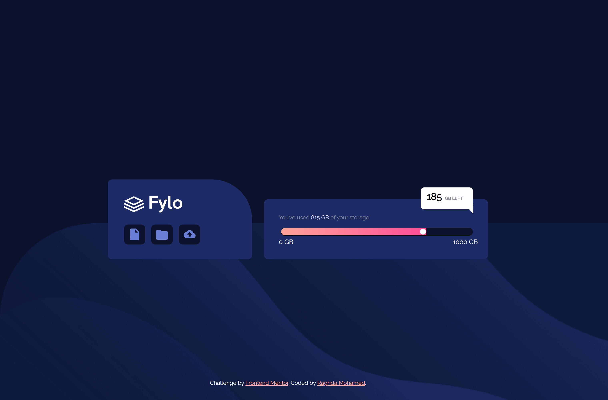
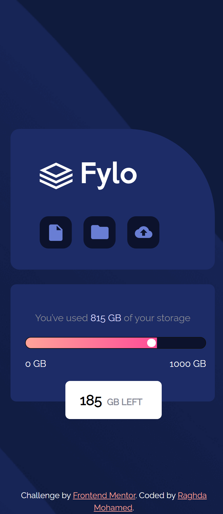

# Frontend Mentor - Fylo data storage component solution

This is a solution to the [Fylo data storage component challenge on Frontend Mentor](https://www.frontendmentor.io/challenges/fylo-data-storage-component-1dZPRbV5n). Frontend Mentor challenges help you improve your coding skills by building realistic projects. 

## Table of contents
  - [Screenshot](#screenshot)
  - [Links](#links)
  - [Built with](#built-with)
  - [What I learned](#what-i-learned)
  - [Author](#author)

### Screenshot

### Links

- Solution URL: [Add solution URL here]([https://your-solution-url.com](https://raghda19.github.io/Fylo-data-storage-component/))
- Live Site URL: ([https://your-live-site-url.com](https://github.com/Raghda19/Fylo-data-storage-component.git))

### Built with

- Semantic HTML5 markup
- CSS custom properties
- [Bootstrap](https://getbootstrap.com/docs/5.3/getting-started/introduction/) 

## Author

- Website - [Raghda mohamed](https://www.your-site.com)
- Frontend Mentor - [@@Raghda19](https://www.frontendmentor.io/profile/Raghda19)

